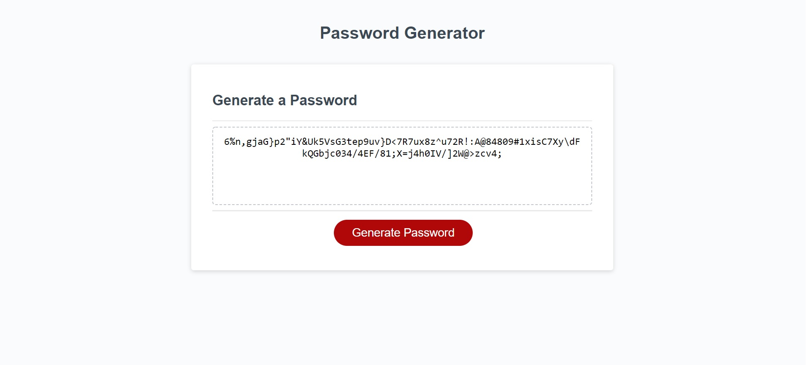

# JavaScript: Password Generator

## Introduction

Within this repository, I was able to create a random password generator using Javascript, CSS and HTML. The HTML and CSS was provided by the Bootcamp, but then the Javascript was created by myself to provide the functionality of the generator. 

The generator works with the user inputting a length of characters they want, and then confirming if they want specific characters to be included in their randomly generated password. It is then displayed on the screen for them to use.

## How It Works

The user will click on the "Generate Password" button which will then create a prompt window that describes what the button does and asks if they would like to begin. If the user chooses to click "cancel" then they are met with a window alert that has a farewell message and the program has ended. 

If the user accepts the conditions and clicks to begin the generator, they are then presented with another window confirmation that asks how many characters they would like their password to be, within 8 to 128 characters. If the user inputs a number outside of that range they are then presented with another window alert that states they chose an incorrect number and they are redirected back to inputting the right length number again. 

Once the user inputs a correct number for the length condition, they are then asked for a confirmation if they would like lowercase characters within their password. They have the choice of accepting (clicking "ok") or declining (clicking "cancel") and this will then log in the backend if they want it or not.

This step then repeats again for uppercase characters, special characters and numeric characters and if they would confirm they want it in the password or not. 

The backend sorts the confirmation of characters by the user and then outputs the randomly generated password into the interface on the webpage. The output will be a length that was determined by the user and will contain the characters that were selected by the user and in a randomly generated order. 

## Screenshot of the Final Product

## URL to the Final Product
https://thebigbookman.github.io/Password_Generator/index.html
